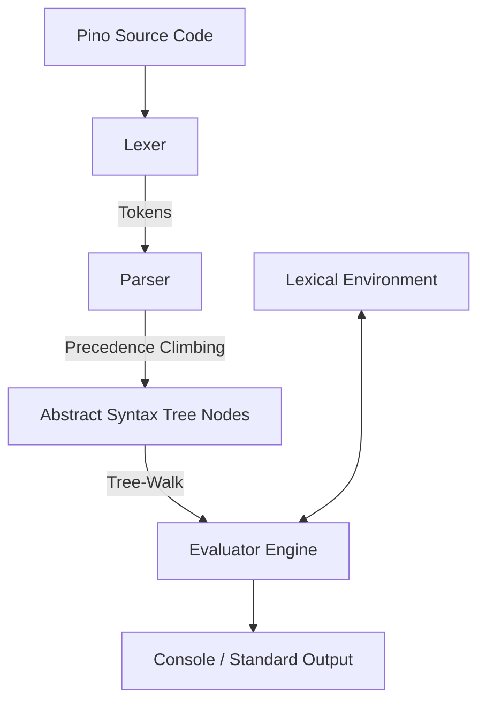

# Pino Lang Architecture

This document provides a comprehensive overview of the Pino Lang project structure, components, compilation/execution pipelines, and developer guidelines.

---

## 1. Overview
Pino is a functional-style, expression-oriented scripting language featuring:
* Strong, scoped lexical environments (constants and mutable variables).
* Struct definition and instantiation with native method bindings.
* Functional APIs (lambda functions, arrow syntax, currying).
* Zero external dependencies in both runtime implementations.

The language maintains two identical runtime engines running in parallel feature parity: a native **C# (.NET 10.0) compiler & interpreter** and a **client-side JavaScript tree-walk interpreter** for interactive web platforms.

---

## 2. Directory Structure

```
pino/
├── pino-csharp/             # Native C# Compiler / Interpreter (.NET 10.0)
│   ├── AST.cs               # Immutable AST Node records (Statements and Expressions)
│   ├── Token.cs             # Token definition and classification types
│   ├── Lexer.cs             # Lexical analyzer (supports string interpolation, numeric separators)
│   ├── Parser.cs            # Recursive-descent parser with Precedence-Climbing
│   ├── Environment.cs       # Scoped lexical storage environment
│   ├── Evaluator.cs         # Tree-walk execution engine and standard library
│   ├── Program.cs           # CLI command routing (run, watch daemon, repl, update)
│   └── dev.pino / main.pino # Test scripts and interactive RPG demo game
│
├── pino-csharp.tests/       # C# Unit Test suite (xUnit)
│   ├── LexerTests.cs        # Tests tokenization rules and boundaries
│   ├── ParserTests.cs       # Tests precedence binding and desugared ASTs
│   ├── StdlibTests.cs       # Tests global functions, string member access, and formats
│
├── pino.site/               # Showcase Website & Live Playground
│   ├── index.html           # Main interface with glassmorphism tabs
│   ├── styles.css           # Premium HSL glow grids and styling
│   ├── playground.js        # Playground editor state and template selector
│   ├── interpreter.js       # Complete tokenization, parsing, and execution in JavaScript
│   └── tests/
│       └── run_tests.js     # Automated Node.js regression test runner
│
└── vscode-pino/             # VS Code Language Integration Extension
    ├── package.json         # Extension manifest mapping file extensions
    ├── language-configuration.json # Brackets matching and comment markers configuration
    └── syntaxes/
        └── pino.tmLanguage.json # TextMate grammar for semantic syntax coloring
```

---

## 3. The Compilation & Execution Pipeline



### A. Lexical Analysis (Lexer)
The Lexer scans raw source characters and maps them to classified tokens (Identifiers, Keywords, Literals, Operators, Markers).
* **Special Cases**: String interpolation triggers (`$variable` and `$(expression)`) are parsed into distinct tokens joined by addition (`+`) operations at scanning time to simplify AST representation.

### B. Syntactic Analysis (Parser)
The Parser is a recursive-descent parser which processes tokens into hierarchical AST nodes.
* **Precedence Climbing**: Used to resolve binding priorities on arithmetic operators and member access operations (`:` and `::`) to ensure statements like `person:budget > 5000` parse correctly.
* **Desugaring**: Compact syntax forms are simplified directly in the Parser. For example, arrow lambda functions (`fn (x) => x * 2`) are desugared into a standard function block containing a single return statement.

### C. Evaluation (Evaluator)
The Evaluator is a tree-walk interpreter that walks the generated AST nodes:
* **Environment**: Manages scopes (parent pointer scopes). Constants defined via `val` are flagged as read-only; reassignments throw runtime exceptions.
* **Struct Instances**: Instances of structs bind a method closure environment linking `self` and `this` back to the instance fields.
* **Exceptions**: Standard controls (e.g. `return`, `break`, `continue`) are implemented via lightweight control-flow exceptions.

---

## 4. C# and JavaScript Engine Parity

To ensure that code running in the local terminal matches the experience in the web playground, both engines must be updated simultaneously:

| Feature / Concept | C# Backend (`pino-csharp`) | JavaScript Backend (`pino.site`) |
| :--- | :--- | :--- |
| **Numeric Types** | `Double` and `Int64` (unified in comparisons) | `Number` (distinguishes integer/float dynamically) |
| **Standard Library** | `RandFunction`, `TimeFunction`, `SleepFunction`, `TypeFunction`, `StrFunction` | Injected into global scope inside `initGlobals()` |
| **String Members** | Evaluated in `EvaluateMemberAccess` | Evaluated in `evaluateExpression` (`typeof target === 'string'`) |
| **Formatting** | `FormatVal` helper in `Evaluator.cs` | `formatVal` helper in `Interpreter` class |
| **Regressors** | `pino-csharp.tests/` (dotnet test) | `pino.site/tests/run_tests.js` (node) |
