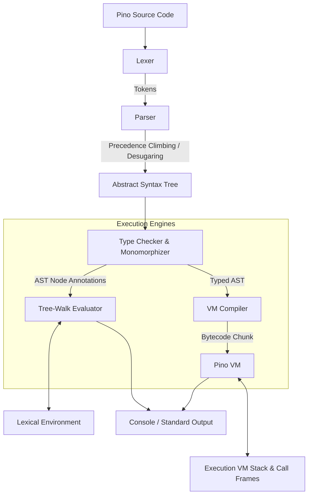

# Pino Lang Architecture

This document provides a comprehensive overview of the Pino Lang project structure, components, compilation/execution pipelines, and developer guidelines.

---

## 1. Overview
Pino is a functional-style, expression-oriented language supporting both top-level scripting and structured program entrypoints (via an automatic parameterless `main` function hook). Key features include:
* Strong, scoped lexical environments (constants and mutable variables).
* Struct definition and instantiation with native method bindings, struct embedding, and composition.
* Structural duck typing for flexible interface compliance checked statically.
* Functional APIs (first-class lambda functions, arrow syntax, currying).
* Zero external dependencies.

The language runs natively on the CLI using the C# (.NET 10.0) implementation, and runs seamlessly in interactive web environments/playgrounds by compiling the same C# codebase to WebAssembly (WASM).

---

## 2. Directory Structure

```
pino/
├── pino-csharp/             # Native C# Compiler / Interpreter (.NET 10.0)
│   ├── AST.cs               # Immutable AST Node records (Statements and Expressions)
│   ├── Token.cs             # Token definition and classification types
│   ├── Lexer.cs             # Lexical analyzer (supports string interpolation, numeric separators)
│   ├── PinoRune.cs          # Native Unicode 32-bit character representation wrapper
│   ├── Environment.cs       # Scoped lexical storage environment (variables/constants)
│   ├── WASMBridge.cs        # Bridge for JS-to-WASM interop execution
│   │
│   ├── Parser/              # Recursive-descent parser with Precedence-Climbing
│   │   ├── Parser.cs            # Entrypoints, token utilities, parameter/property list parsers
│   │   ├── Parser.Expression.cs # Expressions (numbers, identifiers, lambdas, calls, structs)
│   │   ├── Parser.Statement.cs  # Statements (variables, functions, loops, structs, matches)
│   │   └── Parser.Type.cs       # Type signatures parsing (vectors, maps, functions, generics)
│   │
│   ├── Checker/             # Static Type Checker & Monomorphizer
│   │   ├── Checker.cs            # Declaration walks, global tables, monomorphization logic
│   │   ├── Checker.Expression.cs # Expression type compatibility and annotation
│   │   └── Checker.Statement.cs  # Statement scopes, loop variables, static scopes
│   │
│   ├── Evaluator/           # Tree-walk execution engine
│   │   ├── Evaluator.cs            # Base engine, return/break flow control exception routing
│   │   ├── Evaluator.Expression.cs # Tree-walk expression evaluator (method bindings, etc)
│   │   ├── Evaluator.Statement.cs  # Tree-walk statement executor (variable updates, scopes)
│   │   └── Evaluator.BuiltIns.cs   # Global runtime functions (type, print, len, rand, sleep)
│   │
│   ├── VM/                  # PinoVM Stack-based Bytecode Engine
│   │   ├── OperationCode.cs     # Bytecode opcodes (stack, arithmetic, calls, optimizations)
│   │   ├── Chunk.cs             # Instruction array, constants pool, and global boxes
│   │   ├── Compiler.cs          # AST-to-Bytecode monomorphized compiler using static types
│   │   ├── VM.cs                # Virtual Machine interpreter (CallFrames, stack, execution loop)
│   │   └── PinoVMFunction.cs    # Callable wrapper allowing execution in both engines
│   │
│   └── Program.cs           # CLI command routing (run, watch daemon, repl, update)
│
├── pino-csharp.tests/       # C# Unit Test suite (xUnit)
│   ├── LexerTests.cs        # Tests tokenization rules and boundaries
│   ├── ParserTests.cs       # Tests precedence binding and desugared ASTs
│   ├── CheckerTests.cs      # Tests static type checker validations and monomorphization
│   └── Execution/           # Integrated execution test suite running Tree-Walk vs VM
│       ├── ArithmeticTests.cs  # Arithemtic expression checks
│       ├── ControlFlowTests.cs # Loops, conditionals and recursions
│       └── DataStructureTests.cs# Vectors, maps, structs, methods and runes
│
├── pino.site/               # Showcase Website & Live Playground
│   ├── index.html           # Main interface with glassmorphism tabs
│   ├── styles.css           # Premium HSL glow grids and styling
│   ├── playground.js        # Playground editor state and template selector
│   ├── interpreter.js       # Complete tokenization, parsing, and execution in JavaScript
│   └── tests/
│       └── run_tests.js     # Automated Node.js regression test runner
│
└── vscode-pino/             # VS Code Language Integration Extension
    ├── package.json         # Extension manifest mapping file extensions
    ├── language-configuration.json # Brackets matching and comment markers configuration
    └── syntaxes/
        └── pino.tmLanguage.json # TextMate grammar for semantic syntax coloring
```

---

## 3. The Compilation & Execution Pipeline

Pino supports two main execution pathways: a quick AST-based Tree-Walk evaluator and an optimized stack-based Virtual Machine (PinoVM). Both pathways share the front-end scanning and typechecking validation.



### A. Lexical Analysis (Lexer)
The Lexer scans raw source characters and maps them to classified tokens (Identifiers, Keywords, Literals, Operators, Markers).
* **Special Cases**: String interpolation triggers (`$variable` and `$(expression)`) are parsed into distinct tokens joined by addition (`+`) operations at scanning time to simplify AST representation.

### B. Syntactic Analysis (Parser)
The Parser is a modular recursive-descent parser divided across partial files representing expressions, statements, types, and core utilities.
* **Precedence Climbing**: Used to resolve binding priorities on arithmetic operators and member access operations (`:` and `::`) to ensure statements like `person:budget > 5000` parse correctly.
* **Desugaring**: Compact syntax forms are simplified directly in the Parser. For example, arrow lambda functions (`fn (x) => x * 2`) are desugared into a standard function block containing a single return statement.

### C. Static Type Checking & Monomorphization (Checker)
Prior to execution, the `Checker` walks the AST to enforce type safety:
* **Scope Validation**: Resolves variables and constants statically.
* **Generics Monomorphization**: Intercepts generic struct definitions and instantiations, generating specialized monomorphized structures at compile-time to maintain type-safe execution.

### D. AST Tree-Walk Evaluation (Evaluator)
A standard tree-walk interpreter that evaluates AST nodes directly:
* **Environment**: Scoped environment layers mapping identifiers to values.
* **Exceptions**: Routing return, break, and continue logic using lightweight C# exception objects.

---

## 4. The PinoVM Architecture

PinoVM is an experimental stack-based, register-less virtual machine optimized for running Pino bytecode with high performance. It runs in parallel to the Tree-Walk interpreter and is not fully compatible with it. Only supports pure calculation, functions, and basic control flow. Complex structures will fail.

### A. Bytecode Representation (Chunk & OperationCode)
* **Opcodes**: Defined in [OperationCode.cs](pino-csharp/VM/OperationCode.cs), they represent the instruction set of the VM.
* **Opcodes Category**:
  * *Stack operations*: `OP_CONSTANT`, `OP_TRUE`, `OP_FALSE`, `OP_NIL`, `OP_POP`.
  * *Arithmetic & Relational*: Generic ops (`OP_ADD`, `OP_SUB`, etc.) and type-specialized fast ops (`OP_ADD_INT`, `OP_LESS_INT`, etc.).
  * *Variables & Scope*: Globals (`OP_DEFINE_GLOBAL`, `OP_GET_GLOBAL`, `OP_SET_GLOBAL`) and Local slots (`OP_GET_LOCAL`, `OP_SET_LOCAL`).
  * *Control Flow*: Jumps (`OP_JUMP`, `OP_JUMP_IF_FALSE`), Function Calls (`OP_CALL`), and Return (`OP_RETURN`).
  * *Specialized collections*: Optimized operations for collections like `OP_STRING_LEN`, `OP_STRING_GET_INDEX`, `OP_LIST_LEN`, `OP_LIST_GET_INDEX`.
* **Chunk**: Encapsulated in [Chunk.cs](pino-csharp/VM/Chunk.cs), it contains:
  * `Code`: A flat list of raw bytes representing instructions and operands.
  * `Constants`: A deduplicated pool of objects (numbers, strings, runes, functions).
  * `GlobalBoxes`: Indirection boxes pointing to global storage.

### B. The Compiler (Compiler.cs)
The VM Compiler ([Compiler.cs](pino-csharp/VM/Compiler.cs)) translates the static-type-checked AST into a bytecode `Chunk`.
* **Local Variable Mapping**: Employs a compile-time symbol stack (`Locals`) to resolve local variable scopes into stack frame slot offsets at compile-time, eliminating name resolution lookup at runtime.
* **Jump Backpatching**: Compiles conditional branches and loops by first emitting placeholder jump offsets, and later patching them (backpatching) once the target branch body byte size is computed.
* **Static Type Optimizations**: Using the static types inferred by the `Checker`, the compiler emits specialized fast opcodes (e.g. `OP_ADD_INT` instead of generic `OP_ADD` if both operands are statically known to be integers, or `OP_STRING_LEN` if iterating over a string).

### C. The Virtual Machine runtime (VM.cs)
The VM runtime ([VM.cs](pino-csharp/VM/VM.cs)) runs the compiled bytecode chunk.
* **Flat Value Stack**: Houses all local variables, temporary expression values, and function arguments inside a single flat array (`_stack`).
* **Call Frames (CallFrame)**: Manages active function activations (up to 64 nested levels). Each `CallFrame` keeps track of:
  * `Function`: The current [PinoVMFunction](pino-csharp/VM/PinoVMFunction.cs) being executed.
  * `Ip`: The instruction pointer (offset inside the function's chunk code).
  * `Slots`: The base stack index where the local variables and parameters of this frame start.
* **Global Scope Sharing**: Shares the same `Environment` instance as the tree-walk `Evaluator`, allowing seamless access and updates to global variables/constants.
* **Tree-Walk Interoperability**: VM functions implement `IPinoCallable`. When the Tree-Walk evaluator encounters a call to a compiled VM function, it launches a new VM execution frame locally, runs it, and returns the result to the Tree-Walk engine.
