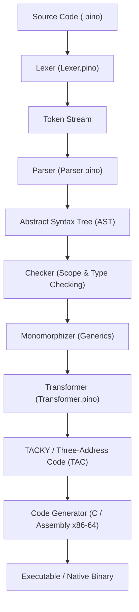

# 🌲 Pino Compiler (Self-Hosted)

`pino-compiler` is the official **self-hosted compiler** for the **Pino** programming language, written entirely in Pino.

## 🎯 Project Vision & Self-Hosting Plan

The Pino language was initially bootstrapped using a C# reference implementation ([pino-csharp](/pino-csharp)). 

The primary goal of `pino-compiler` is to achieve **full self-hosting**:
1. Implement all compiler passes (Lexer, Parser, Type Checker, TAC Transformer, and Code Generator) natively in Pino.
2. Compile `pino-compiler` to C99 / x86-64 Assembly.
3. Bootstrap the Pino toolchain using a minimal C compiler (like TCC or GCC).
4. **Completely eliminate the C# dependency** (`pino-csharp`), producing a lightweight, high-performance, native toolchain.

---

## 📚 Literature & Architecture Basis

The compiler design closely follows the architecture and incremental chapter progression presented in **"Writing a C Compiler"** by *Nora Sandler*, combined with Pino's modern language design:

- **Incremental Progress Alignment**: The passes and features implemented in `pino-compiler` directly track the incremental chapters and techniques validated in our companion C compiler project ([projects/c-compiler](../c-compiler)).
- **Recursive Descent & Precedence Climbing**: Modular AST construction handling operator precedence and desugaring.
- **TACKY / Three-Address Code (TAC)**: Intermediate representation flattening complex nested expressions into explicit 3-operand instructions (`tmp.0`, `tmp.1`).
- **System V ABI x86-64 Alignment**: Frame pointer setup, 16-byte stack alignment, and register allocation rules (`%rdi`, `%rsi`, `%rdx`, `%rcx`, `%r8`, `%r9`).

---

## 🏗️ Compiler Architecture Pipeline

---

## 📂 Module Organization

- [main.pino](./main.pino): Entry point for the compiler CLI.
- [modules/Lexer.pino](./modules/Lexer.pino): Tokenizer and regular expression rule matcher.
- [modules/Parser.pino](./modules/Parser.pino): AST definitions, recursive descent parser, and precedence climbing.
- [modules/Transformer.pino](./modules/Transformer.pino): AST-to-TAC IR transformer (`Val`, `Instruction`, `TAC`).

---

## 📐 Coding Conventions

- **Variable & Constant Naming**: Use `snake_case` for local variables and constants (e.g. `pseudo_var_name_counter`).
- **Error Handling**: Favor functional error handling with `Result[T, E]` and `Option[T]` over thrown exceptions.
- **Pattern Matching**: Use `match` and pattern matching `if x is Pattern(...)` for AST and TAC instruction destructuring.
- **Explicit Yields**: Always mark recovery block returns with explicit `yield` statements.

---

## 📋 Feature Support & TODO Roadmap

### 1. Lexer & Tokenizer
- [ ] Basic Keywords, Identifiers & Literals (Integers, Strings, Runes, Booleans)
- [x] Operators & Multi-character Tokens (`==`, `!=`, `<=`, `>=`)
- [ ] Line comments (`#`) & Whitespace stripping

### 2. Parser & AST Construction
- [x] Integer Constants & Unary Operators (`-`, `not`)
- [x] Binary Arithmetic & Comparison Expressions (`+`, `-`, `*`, `/`, `%`, `==`, `!=`, `<`, `>`)
- [x] Variable Assignments (`x = expr`)
- [ ] Function Definitions & Return Statements (`fn main int { return 2 }`)
- [x] Conditional Expressions (`if cond then a else b`)
- [ ] Match Expressions & Union Variant Destructuring
- [ ] Loop Constructs (`for`, `for in`)
- [ ] Struct Declarations & Member Access (`point:x`)

### 3. Intermediate Representation (TAC / TACKY)
- [x] `Val` Operands (`Constant`, `Var`)
- [x] Basic Instructions (`Ret`, `Unary`, `Binary`, `Copy`)
- [ ] Jump & Label Instructions (`Jump`, `JumpIfZero`, `Label`) for Control Flow
- [ ] Function Call Instructions (`Call`) & Argument Passing

### 4. Type Checker & Scope Resolution
- [ ] Symbol Table & Variable Resolution
- [ ] Type Checking & Type Inference
- [ ] Monomorphization of Generic Functions & Structs (`[T]`)
- [ ] Option/Result `or` block recovery checking

### 5. Code Generation & Execution
- [ ] C Transpilation Target (compilable via `tcc` / `gcc`)
- [ ] Native x86-64 Assembly Emission (`main.s` with System V ABI)
- [ ] Memory Management & Liveness Analysis (Autofree / GC Fallback)
