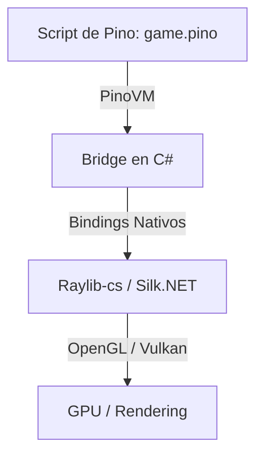

# PEP-003: Futuras Optimizaciones de Rendimiento para la PinoVM & Viabilidad de Librería Gráfica

* **Estado:** Propuesta / Backlog
* **Autor:** Antigravity (AI Assistant) & OGShawnLee
* **Fecha:** 2026-06-19

---

## 1. Futuras Optimizaciones de la PinoVM

Con la llegada del análisis semántico del Checker y la base de bytecode secuencial de la PinoVM, el rendimiento del lenguaje ha mejorado drásticamente (hasta 20x más rápido). Para llevar el rendimiento a niveles competitivos con motores industriales (JIT y C# nativo), se proponen las siguientes optimizaciones teóricas avanzadas para fases posteriores:

### A. Pila de Operandos Tipada (Zero Boxing)
Actualmente, la pila (`_stack`) es de tipo `object?[]`. Esto obliga a realizar operaciones de "boxing" (envoltura en el heap) para enteros grandes, flotantes y booleanos, lo cual incrementa el overhead y activa el recolector de basura (GC).
* **Propuesta:** Crear un struct `Value` que actúe como una *tagged union*:
  ```csharp
  public struct Value {
    public byte Type; // 0 = int, 1 = float, 2 = bool, 3 = object
    public long AsInteger;
    public double AsFloat;
    public object? AsObject;
  }
  ```
  La pila pasará a ser `Value[] _stack`. Al ser structs, se copian por valor en el stack sin asignar memoria en el heap, logrando una reducción de uso de memoria y GC del 100% en loops calientes.

### B. NaN Boxing / Tagged Pointers
Implementado por motores de alto rendimiento como V8 (JavaScript) y LuaJIT.
* **Propuesta:** Representar todos los tipos del lenguaje en un único entero de 64 bits (`double` / `ulong`). Aprovechando el espacio redundante que el estándar IEEE 754 reserva para representar valores `NaN` (Not-a-Number), podemos empaquetar booleanos, enteros de 32 bits y punteros a objetos del heap directamente dentro de un float. Esto optimiza el uso de la memoria caché L1/L2 del CPU al alinear todos los datos a exactamente 8 bytes.

### C. VM Basada en Registros (Register VM)
La PinoVM actual es basada en pila (*stack-based*), requiriendo empujar y sacar operandos constantemente (ej. `OP_GET_LOCAL`, `OP_GET_LOCAL`, `OP_ADD`, `OP_SET_LOCAL`).
* **Propuesta:** Cambiar a una arquitectura basada en registros de propósito general virtuales (similar a la VM de Lua). Las instrucciones pasarían a empaquetar origen y destino en un formato del tipo: `OP_ADD_REG R1 R2 R3` (suma los valores de R2 y R3 y escribe el resultado en R1). Esto reduce la cantidad de instrucciones generadas en el bytecode entre un 30% y 50% y acelera significativamente la fase de ejecución.

### D. Compilación JIT (Just-In-Time) usando IL de .NET
* **Propuesta:** En lugar de interpretar el bytecode mediante un bucle de switches secuencial en C#, el compilador de Pino generaría en caliente instrucciones IL (.NET Intermediate Language) usando `System.Reflection.Emit` o `Expression Trees` para crear métodos dinámicos (`DynamicMethod`). 
* **Resultado:** El JIT de .NET compilaría ese código IL directamente a lenguaje de máquina nativo (ensamblador x64/ARM) al vuelo. Esto haría que Pino corra al **100% de la velocidad de C# nativo**, logrando ejecutar `fib(28)` en un rango de **5 ms a 15 ms**.

### E. Optimización de Llamadas de Cola (Tail Call Optimization - TCO)
* **Propuesta:** Cuando una llamada a función sea la última operación antes de retornar (ej. recursión pura), la VM reutilizará el marco de llamada activo en la pila (`CallFrame`) en lugar de añadir uno nuevo. Esto previene desbordamientos de pila (`StackOverflow`) y elimina el costo de la creación de marcos en algoritmos recursivos.

---

## 2. Viabilidad de una Librería Gráfica de Juegos en Pino 🎮

**¡Sí, es totalmente viable!** Con los tiempos actuales (sub-200ms en Release para lógica recursiva pesada y menos de 30ms para loops de 100k iteraciones), Pino tiene la velocidad necesaria para mantener ciclos estables de rendering a 60 FPS (un presupuesto de **16.6 ms por frame**).

### Arquitectura Propuesta para la Librería de Juegos:

Para lograr un rendimiento óptimo de gráficos sin reinventar la rueda de bajo nivel, Pino puede aprovechar la interoperabilidad de C# con APIs gráficas nativas:



1. **Raylib-cs / SDL2-cs como Backend:**
   Podemos crear bindings a **Raylib-cs** (una envoltura ligera de C# para la librería gráfica Raylib) o **Silk.NET** (OpenGL/Vulkan de alto rendimiento).
2. **Ciclo de Vida del Frame (Game Loop):**
   El motor principal corre en C# encargándose de abrir la ventana, detectar el teclado/ratón y limpiar la pantalla. En cada frame, invoca callbacks rápidos compilados a la VM de Pino:
   ```pino
   fn update() {
     # Lógica de juego en Pino
     if is_key_pressed("Space") {
       player_y -= 10
     }
   }

   fn draw() {
     # Llamadas a renderizado
     draw_sprite("player", player_x, player_y)
   }
   ```
3. **Presupuesto del Frame:**
   Dado que una ejecución típica del compilador/VM de Pino para lógica sencilla de juego tomará apenas **microsegundos** por frame, el 95%+ del tiempo restante estará libre para que la GPU procese los gráficos y mantenga unos 60 FPS extremadamente fluidos.
