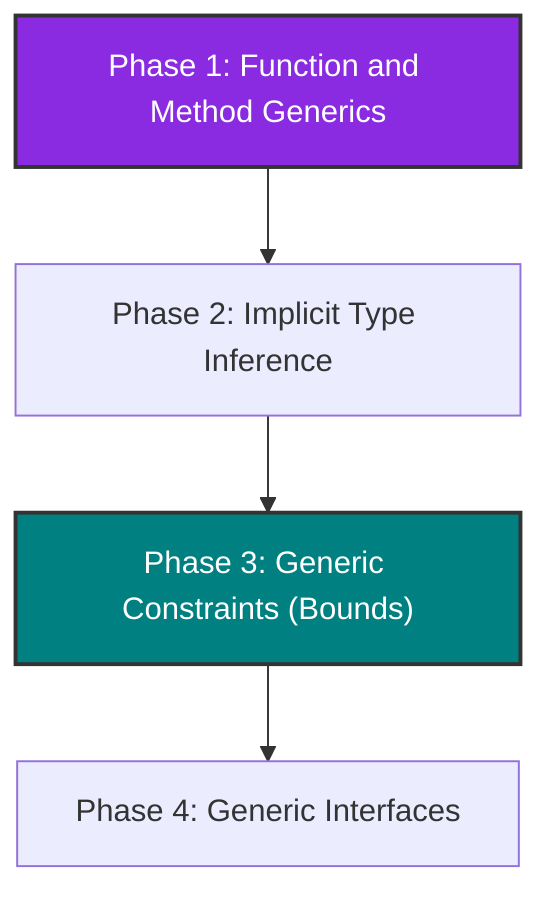

# RFC 004: Generics Evolution Roadmap in Pino

* **Status**: Implemented
* **Authors**: Antigravity & OGShawnLee
* **Date**: 2026-06-24

---

## 1. Summary
Following the introduction of generics at the structure (`struct`) level via compile-time monomorphization, this RFC outlines the roadmap and design steps necessary to extend the Pino Lang type system. The objective is to support **Function Generics**, **Call-site Type Inference (Implicit Generics)**, **Generic Constraints (Bounds)**, and **Generic Interfaces**.

---

## 2. Motivation
The current implementation of generics in Pino is limited to `struct`s (e.g., declaring and using `Point[T]`). However, for Pino to be a truly expressive, reusable, and type-safe language when writing libraries and complex game logic, it is essential to be able to parameterize generic functions and collections with a robust yet lightweight constraint system.

This will allow us to implement common algorithms (mapping, filtering, sorting, searching) in a generic and type-safe way at compile time without incurring runtime performance penalties (zero runtime overhead thanks to monomorphization).

---

## 3. Roadmap



---

## 4. Detailed Design of Phases

### 4.1 Phase 1: Function and Method Generics
Enable standalone functions and static or instance methods to declare their own generic type parameters.

* **Proposed Syntax**:
  ```pino
  @generic[Entry, Result]
  fn map(list []Entry, transform fn(Entry) Result) []Result {
    # Reusable transformation algorithm
  }

  struct Reader {
    @generic[Document]
    static fn read(doc Document) {
      # Generic static method
    }
  }
  ```

* **Compiler Tasks**:
  * **AST**: Add the `GenericParams` property (a list of `GenericParam`) to the `FunctionDeclaration` node.
  * **Parser**: Support the `@generic[T1, T2]` decorator prefix before function declarations, capturing it and attaching it to the function definition.
  * **Checker**:
    * At the call site (e.g., `map[int, string](numbers, transform)`), validate that the number of type arguments matches the generic parameters.
    * Clone the function's AST, substitute the generic type parameters with the provided concrete types, and register the unique monomorphized version (e.g., `map_int_string`) in the global functions table for bytecode compilation and execution.

---

### 4.2 Phase 2: Call-site Type Inference (Implicit Generics)
Allow the compiler to automatically deduce generic type arguments based on the types of the arguments passed to the call, preventing the programmer from having to specify them manually.

* **Proposed Syntax**:
  ```pino
  val numbers = [1, 2, 3]
  # The compiler infers T = int, U = string automatically
  val strings = map(numbers, fn(n int) => str(n))
  ```

* **Compiler Tasks**:
  * Implement a recursive type unifier (`InferGenericParamsFromTypes`) in the Checker.
  * When analyzing a generic function call without explicit type arguments:
    1. Compare the signatures of the formal parameters with the types of the actual arguments.
    2. Resolve the substitutions for type parameters like `T` and `U`.
    3. If unification succeeds without ambiguity, proceed with monomorphization using the inferred types.

---

### 4.3 Phase 3: Generic Constraints (`is` bounds)
Define constraints on generic type parameters to ensure that certain fields or methods exist on the concrete types, allowing them to be safely accessed within the generic function or structure body.

* **Proposed Syntax**:
  ```pino
  interface DocumentShape {
    name string
    page_count int
  }

  @generic[Doc is DocumentShape]
  struct Library {
    catalog map[string, Doc]

    @generic[Doc]
    static fn reading(doc Doc) {
      # Statically validated by the Checker thanks to the constraint!
      println(doc:name)
    }
  }
  ```

* **Compiler Tasks**:
  * **Parser**: Support the `is` keyword inside the `@generic[T is Interface]` decorator syntax.
  * **Checker**:
    * During the type-checking of the generic body, treat the type parameter `T` as a type that possesses the fields and method signatures defined by the specified interface constraint.
    * At instantiation or call site, verify via duck typing (`ImplementsInterface`) that the concrete type provided satisfies all requirements of the constraint interface.

---

### 4.4 Phase 4: Generic Interfaces
Allow interfaces to declare type parameters, enabling flexible abstraction over collections, repositories, or polymorphic design patterns.

* **Proposed Syntax**:
  ```pino
  @generic[T]
  interface Repository {
    fn find_by_id(id string) T
    fn save(entity T)
  }
  ```

* **Compiler Tasks**:
  * **AST/Parser**: Modify `InterfaceDeclaration` to allow the `@generic[T]` prefix before an interface.
  * Adapt the static type compatibility validation (duck typing) in the Checker to recursively substitute generic parameters when evaluating whether a concrete struct implements an instantiated generic interface (e.g., if `SqlPersonRepository` implements `Repository[Person]`).

---

## 5. Implementation Details

All phases described in this RFC have been fully designed, implemented, and verified in the Pino codebase:

* **Phases 1 and 2 (Function/Method Generics & Inference)**:
  * The parser supports the `@generic[...]` decorator attribute prefix before functions and methods.
  * During typechecking in the `Checker`, if type arguments are not explicitly supplied (e.g., `map(list, fn)`), the compiler automatically infers them via `InferGenericParamsFromTypes` by unifying formal parameters with actual argument types.
  * Monomorphization clones the function or method AST, replaces the generic parameters with concrete types, and registers the monomorphized function (e.g., `map_int_string`) into the global function catalog for compilation and bytecode execution.

* **Phase 3 (Generic Constraints - `is` bounds)**:
  * The syntax `@generic[T is Interface]` restricts the types allowed for `T`.
  * During monomorphization, the compiler invokes `VerifyGenericConstraints` to ensure that the concrete type implements all members of the interface using structural duck typing (`ImplementsInterface`), throwing a compile-time static type error if bounds are not satisfied.

* **Phase 4 (Generic Interfaces)**:
  * The compiler now allows declaring parameterized interfaces such as `@generic[T] interface Repository`.
  * Generic interfaces are monomorphized on the fly (e.g., `Repository_Person`) during signature normalization (`NormalizeType`), allowing recursive and transparent duck-typing checks when verifying field and method signature compatibility.
