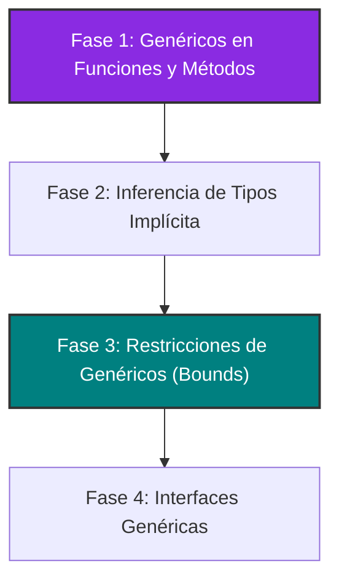

# RFC 004: Hoja de Ruta para la Evolución de Generics en Pino

* **Estado**: Borrador (Draft)
* **Autores**: Antigravity & OGShawnLee
* **Fecha**: 2026-06-24

---

## 1. Resumen (Summary)
Tras la introducción de genéricos a nivel de estructuras (`struct`) mediante monomorfización en tiempo de compilación, este RFC describe la hoja de ruta y los pasos de diseño necesarios para extender el sistema de tipos de Pino Lang. El objetivo es soportar **Genéricos en Funciones**, **Inferencia de Tipos en el Punto de Llamada (Call-site Inference)**, **Restricciones de Genéricos (Bounds)** e **Interfaces Genéricas**.

---

## 2. Motivación (Motivation)
La implementación actual de genéricos en Pino se limita a `struct`s (por ejemplo, declarar y usar `Point[T]`). Sin embargo, para que Pino sea un lenguaje verdaderamente expresivo, reutilizable y seguro al escribir bibliotecas y lógica de videojuegos compleja, es fundamental poder parametrizar funciones y colecciones genéricas con un sistema de restricciones robusto pero ligero. 

Esto nos permitirá implementar algoritmos comunes (búsqueda, mapeo, ordenamiento) de forma genérica y segura en tiempo de compilación sin perder rendimiento (cero overhead en runtime gracias a la monomorfización).

---

## 3. Hoja de Ruta (Roadmap)



---

## 4. Diseño Detallado de las Fases

### 4.1 Fase 1: Genéricos en Funciones y Métodos
Habilitar funciones independientes y métodos estáticos o de instancia para declarar sus propios parámetros de tipo genéricos.

* **Sintaxis Propuesta**:
  ```pino
  @generic[Entry, Result]
  fn map(list []Entry, transform fn(Entry) Result) []Result {
    # Algoritmo de transformación reutilizable
  }

  struct Reader {
    @generic[Document]
    static fn read(doc Document) {
      # Método estático genérico
    }
  }
  ```

* **Tareas en el Compilador**:
  * **AST**: Añadir la propiedad `GenericParams` (lista de `TypeParameter`) al nodo `FunctionDeclaration`.
  * **Parser**: Dar soporte al prefijo `@generic[T1, T2]` (atributos/decoradores) antes de las declaraciones de funciones, cargándolo temporalmente y adjuntándolo a la firma de la función.
  * **Checker**:
    * En el punto de llamada (ej. `map[int, string](numbers, transform)`), validar que el número de argumentos de tipo coincida con los parámetros genéricos.
    * Clonar el AST de la función, reemplazar los tipos genéricos por los tipos concretos suministrados, y registrar la versión monomorfizada única (ej. `map_int_string`) en el entorno de tipos y en la generación de código.

---

### 4.2 Fase 2: Inferencia de Tipos en el Punto de Llamada (Call-site Inference)
Permitir que el compilador deduzca automáticamente los argumentos de tipo genéricos basándose en los tipos de los argumentos pasados en la llamada, evitando que el programador tenga que especificarlos de forma manual.

* **Sintaxis Propuesta**:
  ```pino
  val numbers = [1, 2, 3]
  # El compilador infiere T = int, U = string automáticamente
  val strings = map(numbers, fn(n int) => str(n))
  ```

* **Tareas en el Compilador**:
  * Implementar un unificador recursivo de tipos (`InferGenericParamsFromTypes`) en el Checker.
  * Al analizar una llamada a función genérica sin argumentos de tipo explícitos:
    1. Comparar las firmas de los parámetros formales con los tipos de los argumentos reales.
    2. Resolver las sustituciones del tipo `T` y `U`.
    3. Si la unificación tiene éxito y no hay ambigüedades, proceder con la monomorfización utilizando los tipos inferidos.

---

### 4.3 Fase 3: Restricciones de Genéricos (`is` bounds)
Definir restricciones sobre los parámetros de tipo genéricos para garantizar que ciertos campos o métodos existan en los tipos concretos y puedan ser accedidos de forma segura dentro del cuerpo de la función o estructura genérica.

* **Sintaxis Propuesta**:
  ```pino
  interface DocumentShape {
    name string
    page_count int
  }

  @generic[Doc is DocumentShape]
  struct Library {
    catalog map[string, Doc]

    @generic[Doc]
    static fn reading(doc Doc) {
      # Validado estáticamente por el Checker gracias a la restricción!
      println(doc:name)
    }
  }
  ```

* **Tareas en el Compilador**:
  * **Parser**: Soportar la palabra clave `is` dentro de la sintaxis del atributo `@generic[T is Interfaz]`.
  * **Checker**:
    * Durante el análisis del cuerpo genérico, tratar al parámetro de tipo `T` como un tipo que posee los campos y firmas definidos por la interfaz especificada en la restricción.
    * En la instanciación o llamada, verificar mediante duck typing (`ImplementsInterface`) que el tipo concreto provisto implementa todos los requerimientos de la interfaz.

---

### 4.4 Fase 4: Interfaces Genéricas
Permitir que las interfaces declaren parámetros de tipo, permitiendo una abstracción flexible sobre colecciones, repositorios o patrones de diseño polimórficos.

* **Sintaxis Propuesta**:
  ```pino
  @generic[T]
  interface Repository {
    fn find_by_id(id string) T
    fn save(entity T)
  }
  ```

* **Tareas en el Compilador**:
  * **AST/Parser**: Modificar `InterfaceDeclaration` para permitir el prefijo `@generic[T]` antes de una interfaz.
  * Adaptar las validaciones de compatibilidad de tipos (duck typing) en el Checker para sustituir recursivamente los parámetros genéricos al evaluar si una estructura concreta implementa una interfaz genérica instanciada (ej. si `SqlPersonRepository` implementa `Repository[Person]`).
