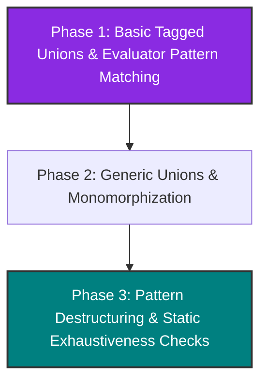

# RFC 005: Tagged Unions and Pattern Matching Evolution Roadmap in Pino

* **Status**: Implemented
* **Authors**: Antigravity & OGShawnLee
* **Date**: 2026-06-26

---

## 1. Summary
This RFC outlines the phased design and implementation roadmap for adding **Tagged Unions (Sum Types)**, generic union monomorphization, and **Pattern Matching** to the Pino language compiler and runtime.

---

## 2. Motivation
Adding tagged unions (also known as algebraic data types or enums with payload) enables safe, expressive data modeling. Instead of using `any` or nullable values, programmers can model optionality and operations like `Result[Value, Error]`. Coupled with pattern-matching `match` blocks, it provides a safe, type-checked flow control that eliminates exception unwinding in the virtual machine.

---

## 3. Roadmap



---

## 4. Detailed Design of Phases

### 4.1 Phase 1: Basic Tagged Unions & Evaluator Pattern Matching
Define basic non-generic unions and implement basic `match` branch evaluation using patterns that extract payloads into variables in local scopes.

* **Proposed Syntax**:
  ```pino
  union Entity {
    Person(string)
    Animal(string, string)
    Ghost
  }

  val hero = Entity::Person("Alice")

  match hero {
    when Entity::Person(name) {
      println(name)
    }
    when Entity::Animal(name, species) {
      println(name)
    }
    when Entity::Ghost {
      println("Boo!")
    }
    else {
      println("Unknown")
    }
  }
  ```

* **Tasks**:
  * **AST**: Add `UnionDeclaration`, `UnionVariant`, and `Pattern` AST nodes (`LiteralPattern`, `IdentifierPattern`, `VariantPattern`, `WildcardPattern`). Update `WhenStatement` to take patterns.
  * **Parser**: Parse `union Name { Variant(types...) }`. Parse patterns inside `when` conditions.
  * **Checker**: Register variants as helper constructor functions. Treat variant constructors (like `Entity::Person`) as static member calls. Under basic checks, declare pattern variable identifiers as `any` in local branch scopes.
  * **Evaluator**: Represent variant values using `PinoUnionValue`. Implement pattern matching matching `PinoUnionValue` variants and binding matching payloads to identifiers in execution scopes.

---

### 4.2 Phase 2: Generic Unions & Monomorphization
Integrate generic parameters into unions using the `@generic[...]` decorator prefix, enabling specialization and type substitution during compiler type check.

* **Proposed Syntax**:
  ```pino
  @generic[Value, Error]
  union Result {
    Success(Value)
    Failure(Error)
  }

  fn try_parse(s string) Result[int, string] {
    # Returns concrete specialized union variant
    return Result::Success(42)
  }
  ```

* **Tasks**:
  * **Parser**: Capture `@generic[...]` decorators before `union` declarations.
  * **Checker**:
    * Implement `MonomorphizeUnion` in `Checker.Monomorphization.cs` to substitute generic type parameters and create concrete specialized unions (e.g. `Result_int_string`).
    * Implement top-down type inference for generic union constructors to determine generic argument bindings from the destination context when some parameters are implicit.

---

### 4.3 Phase 3: Pattern Destructuring & Static Exhaustiveness Checks
Complete full pattern typing and static analysis guarantees.

* **Tasks**:
  * **Checker**:
    * Statically type-check nested patterns and guarantee that variables bound inside patterns have concrete types mapped from the matched union variant signature.
    * Perform static exhaustiveness analysis to assert that every variant of a union is covered in a `match` statement, unless an `else` branch is specified.

---

## 5. Implementation Details

All phases described in this RFC have been fully designed, implemented, and verified in the Pino codebase:

* **Phase 1 (Basic Tagged Unions & Evaluator Pattern Matching)**:
  * The parser parses `union` declarations and variant signatures (with payload types).
  * The checker treats variant constructors as static member calls (e.g., `Result::Success`).
  * The evaluator represents variant values using `PinoUnionValue` containing payloads.
  * Pattern matching recursively unpacks variant values and binds matching fields to local variables during `match` execution.

* **Phase 2 (Generic Unions & Monomorphization)**:
  * The parser captures generic arguments via the `@generic[...]` decorator or bracket syntax (`union Option[T]`).
  * In the static type checker, `MonomorphizeUnion` replaces generic types with concrete types, registers the specialized union declarations in the AST/environment, and rewrites AST node types in-place.
  * Top-down inference resolves generic arguments by combining variant constructor arguments with expected type signatures from variable declarations and function return types.

* **Phase 3 (Pattern Destructuring & Static Exhaustiveness Checks)**:
  * Patterns are statically type-checked, verifying nested payload types and declaring local variables with concrete monomorphized types.
  * Static exhaustiveness analysis guarantees that every variant of a union or member of an enum is covered in a `match` statement unless an explicit `else` branch is provided, raising compile-time errors for missing cases.
