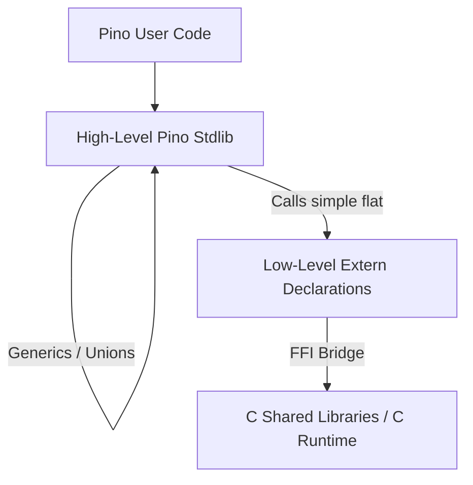

# Proposal: Foreign Function Interface (FFI) & Native C Integration for Pino

## 1. Vision & Goals
To elevate Pino to a powerful systems-programming and high-performance application language, we must transition away from hardcoded compiler built-ins for native operations. Instead, we propose a robust **Foreign Function Interface (FFI)** system.

This proposal outlines the strategy to:
1. **Decouple the Compiler from the Runtime**: Move high-level, generic wrapping logic (like `Result[T, E]`) out of the compiler and write it directly in Pino.
2. **Open C Ecosystem Integration**: Allow developers to declare and call any dynamic/shared library function (e.g., GLFW, OpenGL, SQLite, OpenAL) directly from Pino.
3. **Step-by-Step AI-Friendly Blueprint**: Break down the implementation into atomic, low-context tasks that can be easily parsed and built by code-generation agents.

---

## 2. The Core Architecture
Instead of teaching the transpiler and evaluator how to construct complex generic unions for each operating system operation, we split the responsibility:



### Key Concept: Tuple-Based Error Return (Destructuring)
To return multiple values or status codes from raw C calls, we use Pino's native destructuring pattern. Since tuples in Pino are strictly for return values and destructuring (not standalone objects), we parse the result immediately.

* **C Native Prototype**:
  ```c
  // In runtime.c
  _tuple_int_string pino_raw_read_file(const char* path);
  ```
* **Pino Extern Binding**:
  ```pino
  extern fn pino_raw_read_file(path string) @(int, string)
  ```
* **Pino High-Level Standard Library wrapper**:
  ```pino
  fn read_file(path string) Result[string, IOError] {
      val (err, content) = pino_raw_read_file(path)
      if err != 0 {
          return Result::Failure(map_errno(err, path))
      }
      return Result::Success(content)
  }
  ```

---

## 3. Proposed Syntax Additions

### A. The `extern fn` Keyword
Used to declare functions implemented in native library files (`.dll`, `.so`, `.dylib`).
```pino
# Syntax: extern fn NAME(PARAMS...) RET_TYPE
extern fn glfwInit() int
extern fn glClearColor(r float, g float, b float, a float)
```

### B. The `pointer` Type
To represent generic C memory addresses, handles, or context pointers (like `GLFWwindow*` or `void*`).
```pino
extern fn glfwCreateWindow(width int, height int, title string, monitor pointer, share pointer) pointer
```
* Rules for `pointer`:
  - It has a size of 64-bit (or target architecture address size).
  - Can only be passed to/from `extern` functions.
  - Zero-initialized as a null pointer.

### C. The `@link` Attribute
To specify compilation and linker configuration for the C compiler (TCC/GCC) when building the final binary.
```pino
@link("opengl32", "glfw3")
extern fn glfwInit() int
```

---

## 4. Implementation Plan (AI-Ready Increments)

### Increment 1: Parser & AST Support for `extern`
Extend the Lexer, Parser, and AST to support the new `extern` declaration syntax.
- **AST Nodes**: Create `ExternFunctionDeclaration` containing `Identifier`, `Parameters`, `ReturnType`, and list of libraries to link.
- **Parser**: Parse `extern fn` followed by the function signature.
- **Lexer**: Add `extern` as a reserved keyword.

### Increment 2: Type Checking & The `pointer` Type
Add type verification support in the static Checker.
- **Register Type**: Support `pointer` as a valid primitive type.
- **Checker Verification**: Verify that `pointer` arguments can only be assigned to/from other `pointer` values, or checked against `null`/`0`.
- **Global Function Registry**: Add `ExternFunctionDeclaration` to the list of checked global functions.

### Increment 3: C Transpiler Code Generation
Generate standard C forward declarations and FFI calling code.
- **Header Generation**: If a function is marked `extern fn`, generate a standard C signature:
  ```c
  // extern fn glfwInit() int ->
  int glfwInit(void);
  ```
- **Link Flags**: Collect all libraries declared in `@link(...)` attributes and append them to the C compiler arguments (e.g., `-lglfw3 -lopengl32`).

### Increment 4: Tree-Walk & VM Runtime FFI (Dynamic Binding)
Implement dynamic library loading (`dlopen`/`GetProcAddress`) so that the interpreter/VM can execute `extern` calls on the fly.
- **Dynamic Loader**: Add a helper to load dynamic library dependencies (`.dll` on Windows, `.so` on Linux, `.dylib` on macOS).
- **Execution Bridge**: Use C#'s `System.Runtime.InteropServices.NativeLibrary` or a dynamic wrapper (like `System.Reflection.Emit` or `libffi` bindings) to dynamically call C functions based on parameter types and native pointer arguments.

### Increment 5: Standard Library Refactoring
Refactor current compiler built-ins using this new paradigm.
- Remove C-specific generic output logic from `TranspilerC.cs`.
- Move the C-level implementations of `read_file` and `write_file` directly into C helper functions inside `runtime.c` returning tuple types.
- Define high-level `read_file` and `write_file` in the prelude using pure Pino code wrapping the new `extern` calls.

---

## 5. Proof of Concept: OpenGL / Window Application in Pino
Using this FFI proposal, a simple graphics window in Pino would look like this:

```pino
# Link necessary libraries
@link("glfw3", "opengl32")
extern fn glfwInit() int

@link("glfw3", "opengl32")
extern fn glfwCreateWindow(w int, h int, title string, mon pointer, share pointer) pointer

@link("glfw3", "opengl32")
extern fn glfwMakeContextCurrent(win pointer)

@link("glfw3", "opengl32")
extern fn glfwWindowShouldClose(win pointer) int

@link("glfw3", "opengl32")
extern fn glfwSwapBuffers(win pointer)

@link("glfw3", "opengl32")
extern fn glfwPollEvents()

@link("glfw3", "opengl32")
extern fn glClearColor(r float, g float, b float, a float)

@link("glfw3", "opengl32")
extern fn glClear(mask int)

fn main {
  if glfwInit() == 0 {
    panic("Failed to initialize GLFW")
  }
  
  # Create a window pointer
  val win = glfwCreateWindow(800, 600, "Pino OpenGL Window", 0, 0)
  if win == 0 {
    panic("Failed to create GLFW window")
  }
  
  glfwMakeContextCurrent(win)
  
  # Main render loop
  for glfwWindowShouldClose(win) == 0 {
    glClearColor(0.2, 0.3, 0.3, 1.0)
    glClear(16384) # GL_COLOR_BUFFER_BIT = 0x00004000 (16384)
    
    glfwSwapBuffers(win)
    glfwPollEvents()
  }
}
```

---

## 6. FFI Pointer Interactions & Memory Management

### A. Opaque Handles Pattern (No Dereferencing in Pino)
Pino is a high-level managed language and does not want to expose pointer arithmetic or manual dereferencing to the user. Instead, complex C pointers (like a pointer to a struct `GLFWwindow*` or `sqlite3*`) are treated as **Opaque Handles** typed as `pointer`.

Pino code never accesses the internal fields of these struct pointers directly. Instead, any interaction with the struct's internal state is performed by passing the `pointer` back to library helper functions:
```pino
# Instead of doing win->width = 800, we pass the opaque handle back to GLFW:
glfwSetWindowSize(win, 800, 600)
```
This is the same approach used by JavaScript/WASM, C#, Python, and Java.

### B. Memory Management & Autocontained Resource Cleanup (GC Finalizers)
Since Pino links a Garbage Collector (e.g. Boehm GC) in its C target, memory allocated by Pino itself is automatically freed. However, native libraries allocate memory inside their own heaps (using the system's `malloc` or custom allocators) which the GC does not track.

To keep Pino completely **self-contained and user-friendly**, we avoid warning users about memory management by implementing automatic resource cleanup using **Boehm GC Finalizers**:

1. **Self-Contained Library Bundling**:
   - The Pino compiler distribution includes pre-compiled static libraries (e.g., `libraylib.a`, `libglfw3.a`) inside its `runtime/` folder.
   - When compiling a game, TCC links these libraries statically under the hood. The user does not need to install C libraries manually.

2. **Transparent Garbage Collection (GC Finalizers)**:
   - When a user instantiates a native resource (like a texture, font, or sound buffer), we wrap it in a standard Pino struct:
     ```pino
     struct Texture {
       id int
       width int
       height int
     }
     ```
   - In the compiled C code, the compiler registers a finalizer callback with Boehm GC:
     ```c
     Texture* Texture_construct(int id, int w, int h) {
         Texture* tex = GC_MALLOC(sizeof(Texture));
         tex->id = id;
         // Register custom finalizer called automatically when collected
         GC_register_finalizer(tex, pino_finalize_texture, NULL, NULL, NULL);
         return tex;
     }

     void pino_finalize_texture(void* obj, void* client_data) {
         Texture* tex = (Texture*)obj;
         // Unload texture automatically from OpenGL / GPU memory
         UnloadTexture((Texture2D){ .id = tex->id });
     }
     ```
   - **Result**: Complete automatic lifecycle management. The user never has to manually free, unload, or destroy GPU or OS resources.


